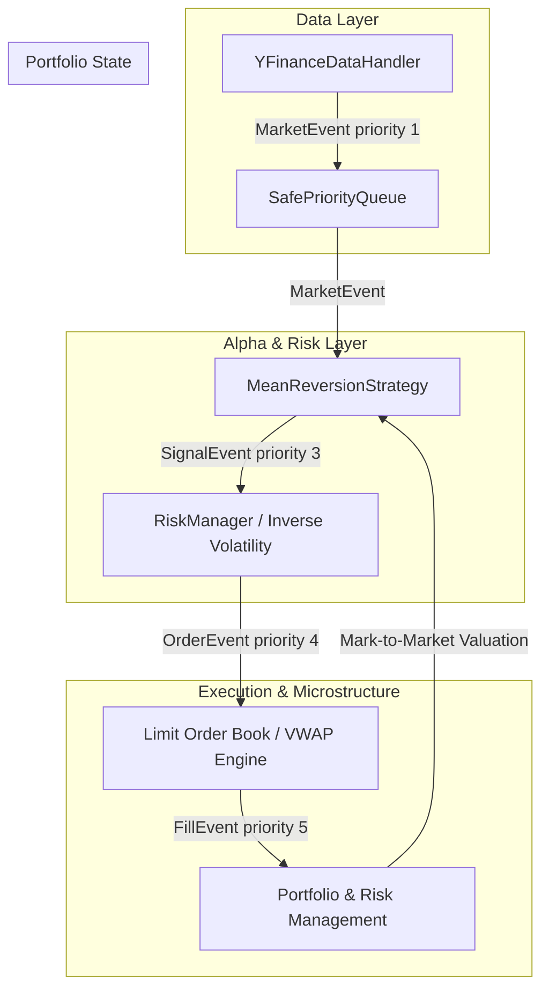

# Backcrawl 📈⚡

[](https://www.python.org/)
[](https://opensource.org/licenses/MIT)
[]()

**backcrawl** is an institutional-grade, event-driven quantitative backtesting and algorithmic trading engine built entirely from scratch in Python. Designed to bridge the gap between abstract alpha research and real-world market execution, `backcrawl` replaces naive vectorized Pandas backtesting with a strict, stateful event loop that eliminates lookahead bias and realistically models market microstructure.

---

## 🏗️ System Architecture

The engine is completely decoupled into modular components interacting asynchronously through a chronological priority queue. Below is the end-to-end event propagation pipeline:



---

## ⚙️ How the Engine Works: Step-by-Step

The inner workings of `backcrawl` mimic real-world electronic trading exchanges and institutional fund infrastructure. The engine operates through a continuous chronological event lifecycle:

### 1. Chronological Data Ingestion (`MarketEvent` - Priority 1)

* **The Feed:** The `YFinanceDataHandler` loads historical asset bars and acts as an asynchronous data feed.
* **Bar-by-Bar Streaming:** Instead of processing an entire dataframe at once, it yields data point by point, creating a `MarketEvent` stamped with the current bar's timestamp.
* **Queue Placement:** The event is pushed into the `SafePriorityQueue` with a priority rating of `1`, ensuring market time advancement takes precedence over all other calculations.

### 2. Alpha Generation & Strategy Evaluation (`SignalEvent` - Priority 3)

* **Triggering Rules:** When the `Backtest` engine pulls a `MarketEvent` from the queue, it triggers the active strategy (e.g., `MeanReversionStrategy`).
* **Restricted History Access:** The strategy queries `data_handler.get_latest_bars(ticker, N)`, retrieving only past data up to the current timestamp. This guarantees absolute zero-lookahead bias.
* **Signal Emission:** If statistical conditions are met (e.g., crossing a z-score threshold), the strategy emits a `SignalEvent` (LONG, SHORT, or EXIT) with a conviction strength multiplier, assigned to priority `3`.

### 3. Risk Parity & Portfolio Interception (`OrderEvent` - Priority 4)

* **Risk Management Check:** Before any signal becomes an order, the `RiskManager` evaluates global portfolio health, running a high-water mark drawdown check (e.g., halting if drawdown exceeds 15%).
* **Inverse Volatility Sizing:** The engine calculates a rolling 20-day annualized volatility metric for the asset. It size-adjusts the position inversely to volatility (Risk Parity) to risk a fixed 1% of total equity.
* **Order Routing:** Validated exposures are transformed into concrete `OrderEvent` instructions (Market Buy/Sell orders) assigned to priority `4`.

### 4. Microstructure Matching & Market Impact (`FillEvent` - Priority 5)

* **Synthetic Order Book:** The `LimitOrderBook` simulates a Level 2 exchange book around the current market price, stocking synthetic liquidity across multiple price tiers.
* **Walking the Book:** Market orders are matched against available liquidity. Large order sizes are forced to "walk the book," crossing multiple depth levels.
* **VWAP Calculation:** The execution engine computes a Volume-Weighted Average Price (VWAP), applying realistic market friction, slippage, and institutional commission costs before emitting a final `FillEvent` (priority `5`).

### 5. Mark-to-Market Portfolio Accounting

* **State Synchronization:** Upon receiving a `FillEvent`, the `Portfolio` updates cash balances, active inventory quantities, and executes mark-to-market valuations for every active asset.
* **Performance Snapshots:** A historical snapshot of total equity, cash, and individual positions is captured at every time index, enabling instant calculation of Sharpe ratios, maximum drawdowns, and interactive Plotly performance dashboards.

---

## 🚀 Key Engineering Highlights

* **Structural Look-Ahead Bias Prevention:** Strategies never see future data rows; they only react to historical feeds passed sequentially through the event queue.
* **Deterministic Tie-Breaker Queue:** Uses explicit tuples `(priority, timestamp, counter, event)` to guarantee exact mathematical execution ordering when multiple events land on the exact same millisecond.
* **Realistic Liquidity Depletion:** Moving away from flat-rate slippage models, the synthetic LOB forces large order sizes to incur mathematical market impact penalties via VWAP matching.

---

## 📁 Repository Structure

```text
backcrawl/
├── core/
│   ├── event.py          # Priority-sorted event dataclasses & SafePriorityQueue
│   └── engine.py         # Main event-driven backtest execution loop
├── data/
│   └── handlers.py       # Bar-by-bar data streaming (YFinance / SQLite)
├── strategies/
│   └── mean_reversion.py # Statistical z-score overbought/oversold model
├── execution/
│   └── lob.py            # Level 2 LOB simulator & VWAP matching engine
├── risk/
│   └── manager.py        # Inverse volatility sizing & drawdown checks
└── main.py               # Entry point for execution and Plotly analytics

```

---

## ⚙️ Quick Start

1. **Clone the repository:**
```bash
git clone [https://github.com/chayanC7mondal/backcrawl.git](https://github.com/chayanC7mondal/backcrawl.git)
cd backcrawl

```


2. **Install dependencies:**
```bash
pip install pandas numpy yfinance plotly sqlalchemy

```


3. **Run the backtest engine:**
```bash
python main.py

```


```

```
